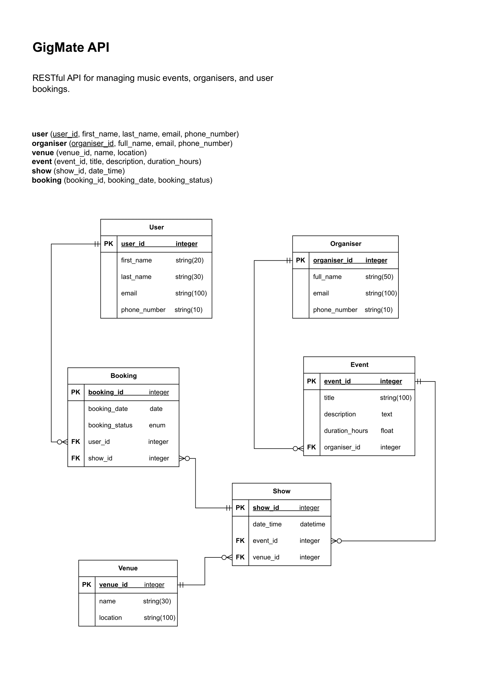
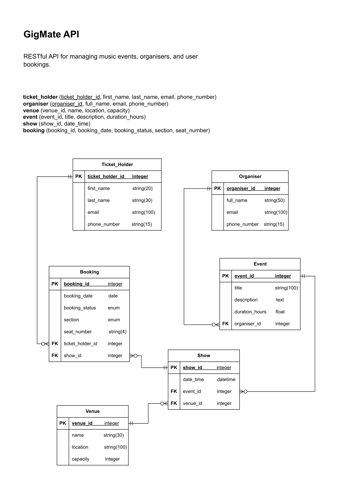

## FEEDBACK LOG 1

Date: 5th October 2025

Checked by: Nick Fahey

Documentation checked: ```Relational ERD```



Feedback:

“Users:
    Phone # - consider longer allowable string entry, e.g. user might input phone number in format +61412345678, which would be 12 chars

Bookings:
    booking_status - enum is good but might consider a separate lookup table - if a new status format is implemented or a new status type added, you could update the status options through the API rather than at DDL level

Event/Show:
    I might not fully understand the use case, at a first glance, I think these two tables could be combined into one with FKs: organiser_id, venue_id. Although if designed to implement the same event type, with a number of shows, then current system makes sense!

User/Organiser:
    Similar to above, I think these could be 1 table. The combined User table could have a 'organiser' column as BOOL, indicating if that particular user is able to organise events, or just an end user. The FK in events could still be organiser_id for clarity.”

Actions taken:

1. Users: Increased datatype from string(10) to string(15) to follow *E.164* standard guidelines. Accommodating international formats and ensuring unique global phone numbers (in case users are booking from overseas).
2. Bookings: Keeping as an enum for now, there are only a few valid options and changes are unlikely. Will monitor future needs; a lookup table can be implemented later if frequent status updates are required.
3. Event/Show: Initially I combined these two tables but when I created seed data I noticed redundancies. Specifically, one event can have many shows. To maintain 3NF and avoid data duplication, I'm keeping the tables separate. This will ensure scalability of the database as more shows and events are added.
4. User/Organiser: Keeping these separate — the vast majority of users are not organisers. Organisers will have different data storage, access and privacy requirements compared to users. Privacy and access control can be implemented more securely by keeping these two entities separate.
<hr>

## FEEDBACK LOG 2

Date: 7th October 2025

Checked by: Joshua Duong

Documentation checked: ```Relational ERD```


Feedback:

“I don't have much I would change as it's pretty good as is.

Minor changes/Recommendations to expand:
Change user to attendee or ticket_holder. This would give clarity to who the user is in respects to the gig.

Seat number (optional) on booking table, Person capacity in venue table for more information on the events

Performer table : Who's the mainliner/sideact at the gig?”

Actions taken:

1. User: It makes sense to change the title of this entity to be more descriptive of the API. Changed `user` to `ticket_holder` — describes the entity better.
2. Booking table: I have added a `section` attribute to define if the booking is for standing, seated, level 1, etc. Followed by an an optional `seat_number` field. This is set as a string(4) to accomodate that seats are assigned by row (usually alphabetical) and then a number. Both important booking information for a gig.
3. Venue table: Added `capacity` to the venue entity to capture a venue's maximum number of ticket holders. Important to not over-sell a venue/event.
4. Performer: No immediate change — this can be adjusted in the future if needed. For now, sideline/leading performers or artists who perform before the main act can be noted in the event description.
<hr>

## FEEDBACK LOG 3

Date: 12th October 2025

Checked by: Adam Nuttal (Senior Front End Web Dev)

Document checked: ```Relational ERD``` & GigMate Repo - https://github.com/lillieharlow/GigMate



Feedback:

“Overall, this project demonstrates professional-level architecture understanding. Your structure, naming conventions, and use of patterns are especially impressive for a first project.

Your database and application validation both show solid comprehension, and your ability to think through real-world scenarios (like NULL venues, cancellations, or venue deletions) shows maturity in your design process. I suggest adding a show_status column to your show model to represent real-world situations that would be separate from booking_status.

The project’s commits show a clear focus on writing clean, maintainable code. This is a foundation that would definitely make you hireable for a junior developer position.

If anything, the main areas to build on next would be adding the remaining ‘polish’ features like testing, error handling, and authentication. You should also look into implementing pagination — especially for GET all routes — as it’s highly important for performance, user experience, and scalability.”

Actions taken:

1. Added additional error handling and validation to my schemas, and double-checked validation logic in my models. Improved error messages to clearly identify specific issues and help guide the user, ensuring the API doesn’t crash unexpectedly.

2. Added a show_status column and enum values to the show model. This provides more flexibility and represents real-world scenarios (e.g., a show being rescheduled rather than cancelled). It also aligns with individual booking cancellations versus entire show cancellations. Updated my ERD to reflect this change.

3. Implemented pagination for the booking model to improve scalability and performance. This ensures that if a user searches through large volumes of bookings or events (for example, venues hosting hundreds of gigs), the API remains fast and responsive without overloading the system.

4. Testing: `test_seat_uniqueness_per_show`, `test_get_ticket_holders`, `test_create_ticket_holder_success`, `test_update_ticket_holder_success`, 

## FEEDBACK LOG 4

Date: